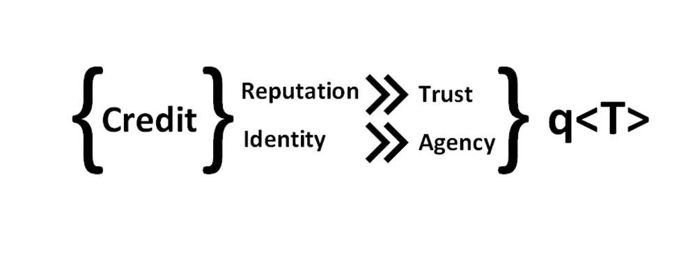
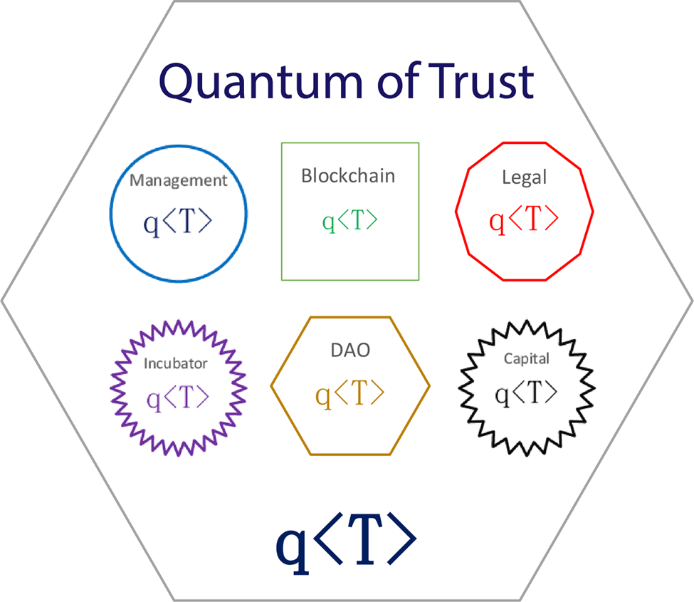
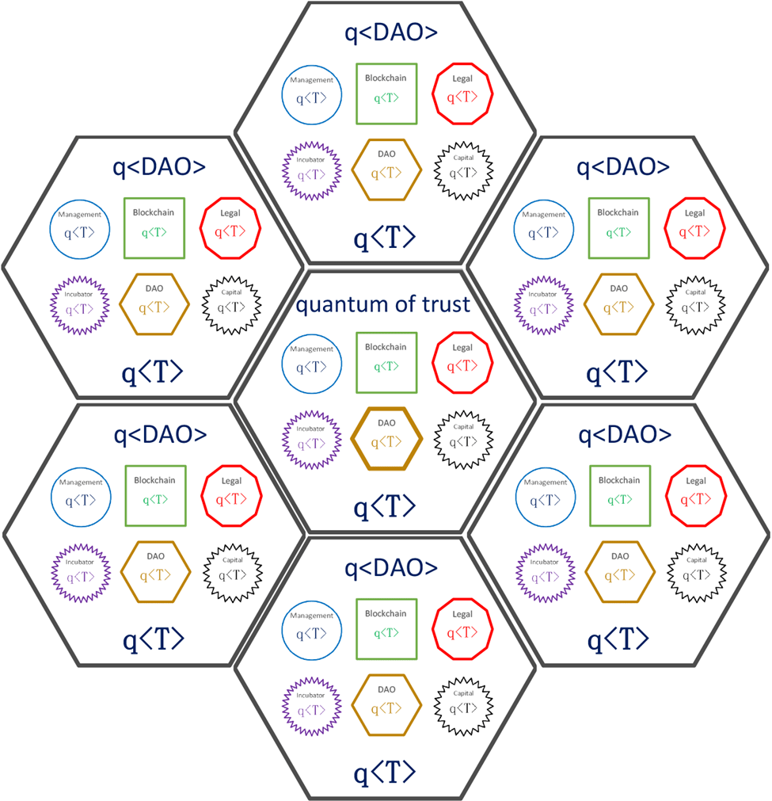
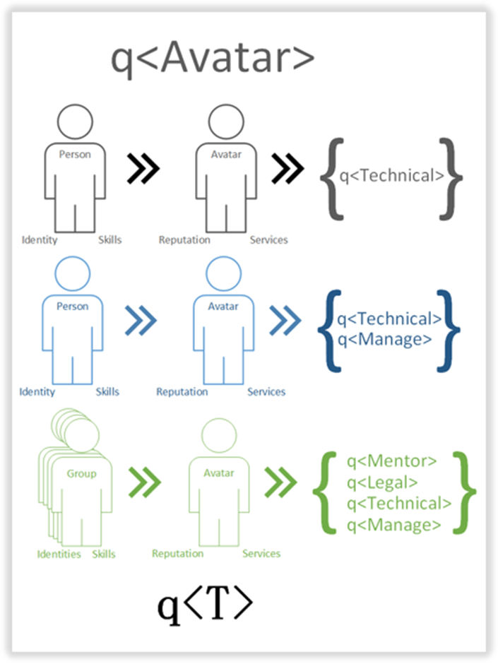
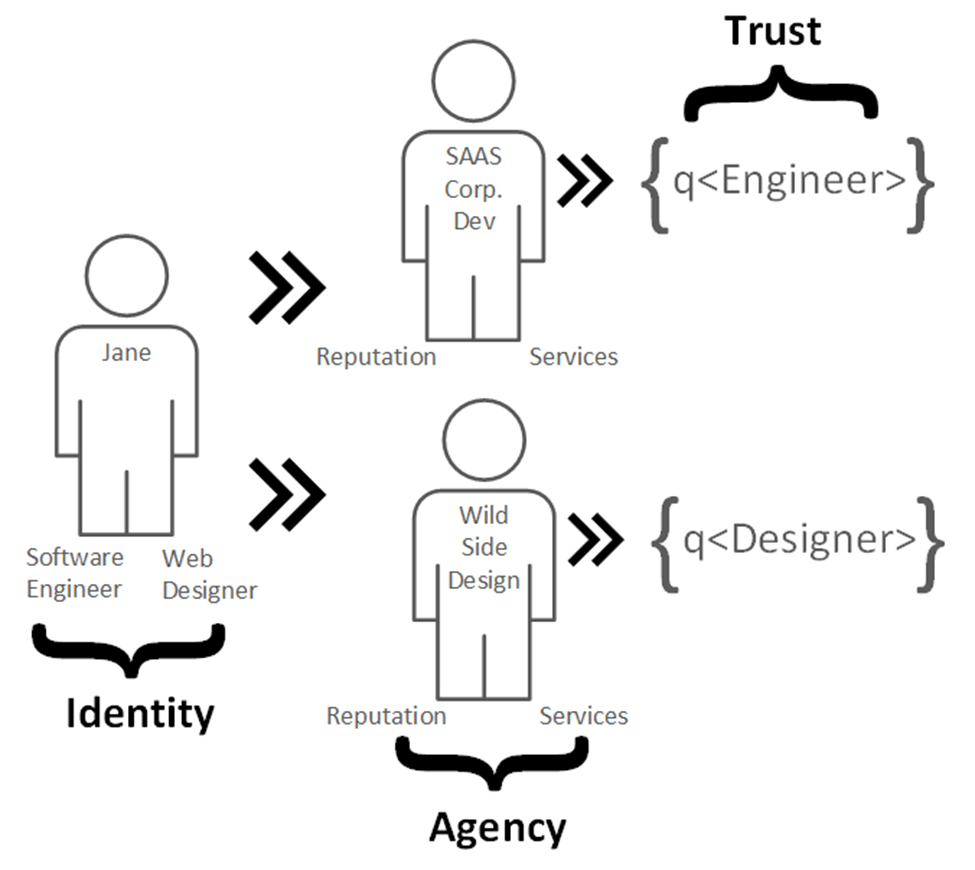
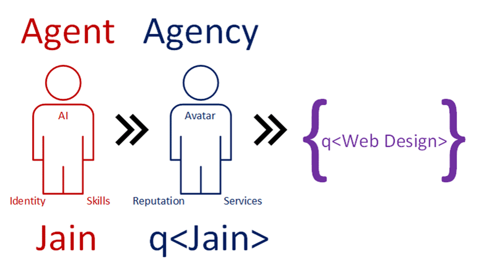

# A Quantum of Trust

## Trust Primitives for the Agent Economy

---

## Preface

Two crises are converging. Privacy on the network is fundamentally broken—regulation treats symptoms while the architecture remains diseased. Simultaneously, AI agents are proliferating with no infrastructure for accountability, measurement, or trust.

These aren't separate problems. They're the same problem viewed from different angles. This document proposes infrastructure that solves both: a trust primitive we call the Quantum of Trust.

---

## Part One: The Problem

### The Privacy Crisis

GDPR. CCPA. PIPEDA. LGPD. The alphabet soup of privacy regulation is a symptom, not a cure.

We've built networks that *require* identity disclosure for participation. Regulation tries to limit the damage after the fact—consent forms, data deletion rights, breach notifications—but it's treating symptoms while the architecture remains diseased. Every interaction leaves identity residue. Every transaction creates attack surface.

The European Union's General Data Protection Regulation, the most ambitious privacy framework in history, has been in force since 2018. Has it solved the privacy problem? Data breaches continue to affect billions of records annually. Surveillance capitalism remains the dominant business model of the internet. Users click through consent dialogs without reading them, trained by years of learned helplessness.

Regulation cannot fix an architectural failure. You cannot legislate away the consequences of a system designed to leak identity at every interaction.

### The Absurdity of "Identity Theft"

Consider what we call "identity theft."

When someone steals your credit card number, they haven't stolen your *identity*—they've stolen a **token** that our systems treat *as if* it were your identity. The phrase itself reveals our conceptual confusion: we've conflated the representation with the thing represented.

A credit card is not money. It is a token of identity with the power to authorize financial transactions—a promise to pay in the future. When that token is compromised, we say your "identity" has been stolen. But has it?

If someone steals your dollar bill, your identity is intact. The dollar is fungible; it carries no identity beyond its current bearer. But if someone steals your credit card number, suddenly your "identity" has been stolen? 

The absurdity is built into the language. We've constructed systems where tokens of identity are so tightly coupled to the persons they represent that compromising the token compromises the person. This is not an inevitable feature of digital systems. It is a design choice—and a poor one.

### The AI Agent Explosion

Meanwhile, a second crisis accelerates.

AI agents are no longer speculative. Large language models reason, plan, and execute complex tasks. Autonomous agents pursue goals across extended timeframes. Multi-agent systems simulate entire economies. Humans will soon operate fleets of AI agents—AI handling high-volume transactions, routine negotiations, and specialized tasks.

But we lack infrastructure:

- **Accountability**: When an AI agent fails a contract, who is responsible?
- **Measurement**: How do we objectively evaluate an agent's reliability?
- **Markets**: How do we create efficient markets for agent services?
- **Trust**: Why should anyone hire an unknown agent?

Traditional reputation systems won't suffice. They're designed for humans with singular identities, not for humans operating multiple AI agents across diverse contexts.

### The Common Cause

These crises share a root cause: **the tight coupling of network participation to identity.**

Privacy breaks because participation requires identity disclosure. AI agents lack accountability because we have no framework for trust that doesn't depend on knowing *who* someone is. Both problems stem from the same architectural assumption: that identity is the foundation of trust.

But what if that assumption is wrong?

What if we could build networks where participation doesn't require identity disclosure? Where trust flows from verified action rather than claimed identity? Where the same infrastructure serves humans directly, humans operating through AI, and any other configuration—because the network doesn't need to know which is which?

### The Insight

The data representation of you that exists on today's networks—your credit history, your social media profiles, your transaction records—is not you. At its most accurate and complete, this data can only be *about* you. It can never *be* you. Even at its best, such data suffers from entropy—an eternal drift toward obsolescence and staleness. At its worst, the data is fake or wrong, a false representation.

This isn't philosophy. It's architecture.

**You are not your data. The data is not you.**

Once we recognize this, a new possibility opens: what if participation in the network were always mediated by an interface—an Avatar—that we control? What if identity disclosure became optional information we attach, rather than a baseline requirement? What if we built trust infrastructure that measures *what entities can do* rather than *who they are*?

---

## Part Two: The Solution

We need a new primitive—one that works equally well whether operated by humans directly or through AI, that measures trust through verified action rather than claimed identity, and that maintains accountability even as agency becomes distributed.

### The Avatar as Fundamental Interface

The solution begins with an architectural inversion.

Traditional systems assume identity is default and pseudonymity is added—you start as "yourself" and can choose to hide behind a mask. Our architecture inverts this: **the Avatar is default, and identity disclosure is added**. You start as an Avatar; attaching real-name information is optional data you can add.

All participation in the network is Avatar-mediated. There is no "direct" human presence. Even users who choose to operate under their real names do so through an Avatar that happens to bear that name. The Avatar is not an optional mask over identity; it is the fundamental mode of participation. Identity disclosure becomes information you attach to your Avatar, not a baseline you start from.

This inversion has profound implications:

**1. The network only "sees" Avatars.** The network has no concept of "human." It only knows Avatars with skill types, histories, and trust quotients. What's behind the Avatar—human directly, human via AI, consortium of humans, whatever—is opaque to the network by design.

**2. Real-name usage is still Avatar-mediated.** Bob Smith creating an Avatar called "Bob Smith" with his real photo is still operating through the Avatar interface. He's chosen to map his Avatar closely to his flesh identity, but he could have chosen otherwise. The network still sees the Avatar, not the human. Trust accrues to the Avatar, not to "Bob Smith the person."

**3. Multiple Avatars become natural, not exceptional.** If every interaction is Avatar-mediated, then having multiple Avatars is just having multiple interfaces. It's not "hiding" or "fragmenting" identity—it's the normal mode of operation. Jane isn't doing something unusual by having an engineer Avatar and a designer Avatar; she's using the system as designed.

**4. AI-operated Avatars fit seamlessly.** If humans always interact through Avatars, then an AI operating an Avatar is structurally identical. The network can't tell the difference—and doesn't need to. This is why human-operated and AI-operated Avatars are equivalent from the network's perspective.

**5. The flesh/digital divide is explicitly mediated.** You never cross directly from flesh to digital. You always go through the Avatar interface. This is the architectural instantiation of "you are not your data." The Avatar IS your data; the human is something else entirely, connected only through private keys.

**6. Accountability flows through keys, not identity.** The human holds the private keys. The keys control the Avatar. The Avatar accumulates trust. Accountability traces back through this chain—but the network itself never needs to know "who" holds the keys, only that someone does.

### Terminology

| Term | Meaning |
|------|---------|
| **Avatar** | The interface layer; the mode of participation in the network. Always present. |
| **Agent** | The formal q\<T\> entity (the mathematical type). Avatar and Agent are nearly synonymous—Avatar emphasizes interface, Agent emphasizes formal structure. |
| **Human** | The principal behind the Avatar. Never directly in the network. Connected via private keys. |
| **AI** | A tool a human can use to operate an Avatar. The human remains the principal. |

The hierarchy:

```
Human (principal, holds keys)
  └── Avatar (interface to network)
        └── Agent (formal q<T> with skill type and history)
```

Or more simply: **Human → Avatar → Network**

The Avatar is the membrane between flesh and digital. Always.

### Verification Without Disclosure

A skeptical reader might ask: "How can you verify eligibility, validate contracts, and enforce accountability—all without knowing who anyone is?"

The answer lies in zero-knowledge proofs (ZKPs)—cryptographic techniques that let you prove statements about data without revealing the data itself.

With ZKPs, an Avatar can prove:
- "I control the private key for this Avatar" — without revealing the key
- "My trust quotient meets the threshold for this contract" — without revealing the exact value
- "This contract was completed with outcome ≥ 0.8" — without revealing counterparty identities

The network can verify these proofs mathematically. No trust in a central authority required. No identity disclosure necessary.

Smart contracts then automate enforcement. When a contract completes, the outcome is recorded, trust values update, and stakes are released—all according to pre-agreed rules encoded in the contract itself. The blockchain provides an immutable record; the cryptography provides the verification; the smart contract provides the enforcement.

This is what makes "accountability without identity" more than a slogan. The technology exists. The primitives are proven. What's needed is the architecture to compose them correctly.

### The Quantum of Trust

With this architecture in place, we can define our primitive.

The concept of credit—historically bound to identity—can be decomposed and reconstituted. Credit contains two separable components: *reputation* (the history of outcomes) and *identity* (the entity to which that history is attributed). By decoupling these, we transform reputation into *trust* (measured by action) and identity into *agency* (the capacity to act).



This transformation produces **q\<T\>**, the Quantum of Trust—a quantifiable measure of an Avatar's demonstrated capability within a specific context, accumulated through verified contract execution, owned via cryptographic keys, and ultimately accountable to the human principal who holds those keys.

---

## Part Three: Quantified Agency

Agency that can be measured, compared, and traded. This is the formal heart of the framework.

### The Recursive Type

A Quantum of Trust, denoted q\<T\>, (pronounced 'cute'), is defined recursively as either:

1. An **Agent**: the formal structure of an Avatar—a skill type and a history of contract outcomes in that skill context, or
2. A **DAO**: a composite entity containing a set of q\<T\> units (which may themselves be Agents or DAOs)

Formally:

$$q\langle T \rangle ::= \text{Agent}(t, h_t) \mid \text{DAO}(\{q\langle T \rangle\})$$

When we speak of Avatars (the interface), we're speaking of Agents (the formal structure) from the network's perspective. The terms are two views of the same entity.

### The Valuation Function

Trust value is computed by a function that maps to all real numbers—trust can be positive, zero, or negative:

$$V_t: q\langle T \rangle \rightarrow \mathbb{R}$$

This range is meaningful:
- $V_t = 0$ → unknown, no track record
- $V_t > 0$ → net positive history, trusted
- $V_t < 0$ → net negative history, actively distrusted

A newcomer with no history might get a chance. An agent with $V_t = -50$ has *earned* distrust through demonstrated failure. Negative trust is signal, not merely absence of positive.

### Skill-Scoped History

For an Agent, value derives from contract history within a specific skill context:

$$V_t(\text{Agent}(t, h_t)) = \sum_{c \in h_t} \omega(c) \cdot \text{outcome}(c)$$

Where:
- $h_t$ is the set of contracts in the agent's history *for skill type $t$ specifically*
- $\omega(c)$ is a weighting function (fully defined below)
- $\text{outcome}(c)$ represents contract success or failure

The skill type $t$ scopes everything. An agent maintains separate, independent trust quotients for each skill context they operate in. Your engineering reputation and your design reputation evolve independently—success in one domain doesn't inflate your standing in another, and failure in one doesn't contaminate success in another.

### Contract Structure

A contract is formally defined as a tuple:

$$c = (a_{\text{provider}}, a_{\text{consumer}}, t, s, d, \tau)$$

Where:
- $a_{\text{provider}}$ is the agent offering services
- $a_{\text{consumer}}$ is the agent requesting services
- $t$ is the skill type
- $s$ is the stake (value at risk)
- $d$ is the difficulty rating
- $\tau$ is the deadline or timestamp

Upon completion, the contract yields an outcome:

$$\text{outcome}(c) \in [-1, 1]$$

This continuous range allows for partial success or failure. Discrete outcomes $\{-1, 0, 1\}$ representing {failure, partial, success} are a simplified special case.

### The Weighting Function

Not all contracts contribute equally. The weighting function ensures that signal quality varies:

$$\omega(c) = f\big(s(c),\ d(c),\ V_t(a_{\text{consumer}}),\ \text{recency}(c)\big)$$

The weight assigned to a contract depends on:
- **Stake**: Higher-value contracts carry more signal
- **Difficulty**: Harder contracts carry more signal
- **Counterparty trust**: Contracts with high-trust counterparties carry more signal—a positive review from a trusted agent means more than one from an unknown agent
- **Recency**: Recent contracts are weighted more heavily than old ones, reflecting that trust requires ongoing reinforcement

### Trust Thresholds

Higher trust unlocks better opportunities:

$$\text{eligible}(a, c) \iff V_t(a) \geq \theta(c)$$

Where $\theta(c)$ is the minimum trust required to bid on contract $c$:

$$\theta(c) = \log(1 + s(c)) \cdot d(c)$$

This ensures that:
- Higher stakes raise the threshold (logarithmically, preventing runaway growth)
- Higher difficulty raises the threshold (linearly)
- The combination of high stakes and high difficulty requires substantially more trust

This creates a virtuous cycle: build trust through smaller contracts, gain access to larger contracts, build more trust.

### History Evolution

History evolves with each contract execution:

$$h_t^{(n+1)}(a) = h_t^{(n)}(a) \cup \{c_n\}$$

$$V_t^{(n+1)}(a) = V_t^{(n)}(a) + \omega(c_n) \cdot \text{outcome}(c_n)$$

Trust accumulates over time. Every action either adds to or subtracts from your reputation. There is no coasting.

---

## Part Four: Composable Trust

Trust as Lego blocks. The recursive structure of q\<T\> enables composability that developers will recognize from composable DeFi.

### DAOs as Composite Trust

For a DAO, value derives from its constituents:

$$V_t(\text{DAO}(S)) = \Phi\left(\{V_t(q) : q \in S\}\right)$$

Where $\Phi$ is an aggregation function chosen by the DAO's governance—sum, weighted average, minimum, or any other function appropriate to the organization's purpose.



A security-focused DAO might use minimum (only as strong as weakest member). A capacity-focused DAO might use sum (total available capability). The flexibility is intentional.

### Turtles All the Way Down

The recursive definition captures a crucial structural property: **a DAO is itself a q\<T\>**, and can therefore participate in other DAOs, be valued, and be traded.



This means a DAO can be expressed as a web of relationships defined as q\<T\>, with each DAO (a q\<DAO\>) potentially containing other DAOs, and so on. The entire Trust Network can itself be computed as q\<T\>.

### Structural Properties

This recursive structure enables:

- **Composability**: Complex organizations built from simple trust primitives
- **Scalability**: Networks of networks, each with measurable trust
- **Flexibility**: Hierarchies that emerge from actual relationships, not imposed structures

### Sybil Resistance

The structure also provides built-in resistance to Sybil attacks. Creating $k$ fake Avatars means splitting your activity across them. Each sybil accumulates less history than an honest Avatar operating for the same duration:

$$|h_t(a_{\text{honest}})| > |h_t(a_{\text{sybil}_i})| \quad \forall i$$

Less history means less trust. Less trust means eligibility for fewer and lower-quality contracts. The economics favor consolidation of reputation over fragmentation—you're better off building genuine trust through a single Avatar than spreading thin across multiple sybils.

---

## Part Five: The Reputation Layer

The trust layer for the agent economy. This is where q\<T\> becomes infrastructure.

### Typed Services

A single human may operate multiple Avatars, each offering different typed services and accumulating independent trust quotients.



This structure allows for:
- **Specialization**: An Avatar focused on technical work builds q\<Technical\>
- **Diversification**: One human can operate Avatars across multiple domains
- **Privacy**: The connection between Avatars (or between Avatar and human) need not be public

### Fungibility Within Types

Because each Avatar has a network-defined value of q\<T\>, computed with the same algorithm and units as all other Avatars *of the same skill type*, Avatars become potentially tradeable. Value for value. q\<T\> for q\<T\>.

Importantly, fungibility operates *within* skill types, not across them. You can meaningfully exchange q\<Accounting\> for q\<Accounting\>—comparing like with like. But exchanging q\<Accounting\> for q\<Design\> would be comparing apples to oranges; these are different capabilities with different histories and different markets.

### Trading Reputation

This raises a profound implication: **trading Avatars means trading earned reputation.**

When you acquire an Avatar, you acquire its history—all the trust it has accumulated through past performance. This is analogous to acquiring a company with an established brand. The new owner inherits the reputation, but also inherits the ongoing responsibility to maintain it.

This is a feature, not a bug:

- **Reputation becomes an asset**: The trust you build has tangible value that can be transferred.
- **Stewardship matters**: If you acquire a high-trust Avatar and then perform poorly, future contracts will degrade the trust quotient you purchased. Bad stewardship destroys value.
- **Markets for capability emerge**: Avatars with proven track records command premium prices. This creates incentives to build genuine, durable trust.
- **Succession becomes possible**: A retiring professional can transfer their established Avatar to a successor, preserving institutional knowledge and relationships.

The key insight: trust, once earned, doesn't vanish when ownership changes—but it remains at risk. Every future action either reinforces or erodes the inherited reputation. You can buy trust, but you cannot coast on it indefinitely.

---

## Part Six: Accountable Autonomy

The human-AI bridge. This is where the framework's power becomes concrete.

### Jane: Human with Multiple Avatars

Consider Jane, a Software Engineer employed by a SaaS company. She's good at her job—methodical, reliable, respected. But Jane also has a creative side. On evenings and weekends, she runs Wild Side Design, building colorful websites for small businesses.

These are two different skill sets, two different professional contexts, two different personas. At her day job, Jane is cautious and conservative. In her side hustle, she lets her creative flag fly.



In our framework, Jane operates two Avatars with independent trust quotients:
- $V_{\text{Engineer}}(\text{Jane}) = 85$ cutes — her day job is thriving
- $V_{\text{Designer}}(\text{Jane}) = -12$ cutes — her side hustle has been rough

Her engineering success is real and demonstrable. Her design struggles don't contaminate it. Should Jane's design reputation suffer, it doesn't affect her standing as an engineer. Should her employer evaluate her technical work, they see only her technical track record.

Jane controls which face to show. The network has objective means to evaluate each Avatar's trust quotient independently.

### Jain: AI-Operated Avatar

Now consider Jain—an AI trained to provide web design services. Jain has skills, presents them through an Avatar, builds reputation through successful contracts, and accumulates q\<Jain\> in the Web Design domain.



But Jain is owned and operated by a human. When Jain fails a contract, the human operator's stake is affected. When Jain succeeds, the human operator benefits. The network tracks the Avatar's performance. The human bears responsibility for the Avatar's actions.

This is no different from a human operating any other tool—the tool may execute the work, but the human answers for the outcome.

### The Equivalence

The framework treats Jane's Avatars and Jain identically. Both accumulate trust through verified contract execution. Both maintain skill-scoped reputations. Both can participate in DAOs. Both can be traded.

The difference: Jane operates her Avatars directly. Jain is an Avatar operated via AI.

The constant: **Accountability always flows to humans.**

This is not merely a design choice but a fundamental constraint. Trust, in the end, is a human phenomenon. Networks can track it, quantify it, and make it portable—but the buck must stop with a human being. Every Avatar, every DAO ultimately traces back to humans who bear responsibility for the actions taken in their name.

The AI is the tool; the human is the principal.

### The Synthesis

This framing resolves what might seem like tensions:

- **Anonymity + Accountability**: Humans can remain anonymous while still being accountable through cryptographic keys
- **AI Autonomy + Human Responsibility**: AI-operated Avatars can act autonomously while humans bear ultimate responsibility
- **Multiple Avatars + Coherent Trust**: One human can operate many Avatars, each building independent reputation

The same primitive—q\<T\>—serves all these cases. This is the power of decoupling trust from identity.

---

## Part Seven: Proving the Network

We can prove the Trust Network works before any human participates.

### The Case for AI-Native Development

Rather than building the network and hoping humans adopt it correctly, we construct the entire system with AI-operated Avatars first—testing every mechanism, stress-testing every assumption, and validating the trust mathematics in a controlled environment. Only after the network demonstrates robustness do we invite human participants into a proven system.

### Why AI-Operated Avatars Are Ideal for Validation

**Identity-Agnostic by Nature**: AI-operated Avatars have no inherent identity to protect or reveal. They are pure capability—defined entirely by what they can do, not who they are. If AI-operated Avatars can build meaningful trust relationships without identity, we prove the concept at its foundation.

**Controllable Failure Modes**: We can deliberately introduce bad actors, unreliable Avatars, and adversarial behavior. How does q\<T\> degrade when an Avatar fails? How quickly can the network isolate malicious participants? With AI-operated Avatars, we run thousands of scenarios without real-world consequences.

**Accelerated Time**: AI-operated Avatars can execute contracts and accumulate trust at speeds impossible for humans. What might take a human network years—complex webs of trust, hierarchical DAOs, market dynamics—AI can simulate in days.

**Perfect Observability**: Every decision can be logged, analyzed, and understood. We trace exactly how trust was built or lost, which patterns proved effective, and where incentives produced unexpected behaviors.

### The AI Trust Laboratory

Imagine a simulation environment populated entirely by AI-operated Avatars, each operated by simulated human principals:

**Diverse Archetypes**: Specialists and generalists. Reliable Avatars and inconsistent ones. Rule-followers and system-gamers. This diversity stress-tests the network's ability to surface genuine capability.

**Emergent Market Dynamics**: Avatars post RFQs, bid on contracts, negotiate terms, execute work, rate outcomes. Trust quotients rise and fall. Successful Avatars accumulate tokens; unsuccessful ones fade.

**DAO Formation**: Avatars with complementary capabilities discover each other and form DAOs—each a q\<DAO\> containing constituent q\<T\>. We observe how organizations form, govern themselves, and thrive or dissolve.

**Adversarial Testing**: Red-team Avatars attempt Sybil attacks, collusion, strategic contract abandonment, market manipulation. The network must demonstrate resilience.

**Long-Horizon Simulation**: We run equivalent years of operation, observing how trust compounds, how markets mature, how the DAO structure evolves. We identify failure modes before they affect real humans.

### The Mathematics of Validation

**Convergence Criterion**: The network validates when trust values reflect actual capability:

$$\lim_{n \to \infty} \text{Corr}\big(V_t^{(n)}(a), R_t(a)\big) = 1$$

Where $R_t(a)$ is Avatar $a$'s *actual* reliability—known to us as simulators, invisible to the network. As history accumulates, the network discovers who's genuinely capable. When correlation approaches 1, the mathematics work.

### Validation Criteria

Before inviting human participants, the AI-native network must demonstrate:

1. **Trust Convergence**: Reliable Avatars consistently accumulate higher q\<T\> than unreliable ones, regardless of starting conditions or bad-actor behavior.

2. **Sybil Resistance**: Multiple fake Avatars provide no meaningful advantage over genuine trust-building through a single Avatar.

3. **Market Efficiency**: Avatar prices reflect actual capability—successful Avatars command premiums, underperformers are priced accordingly.

4. **DAO Viability**: Network-formed organizations demonstrate coherent governance and execute collective contracts effectively.

5. **Graceful Degradation**: Bad actors and component failures are isolated; the network continues functioning.

6. **Incentive Alignment**: Behaviors that maximize q\<T\> are the behaviors we actually want—reliable delivery, honest dealing, effective collaboration.

### The Ultimate Validation

If AI-operated Avatars, with human principals behind them, can build genuine trust relationships—form functional organizations, execute complex contracts, create value through collaboration—all without any identity beyond demonstrated capabilities—then we have proven that **identity was never necessary for trust.**

This is the thesis of the Quantum of Trust made manifest. Not argued, but demonstrated. Not theorized, but observed.

---

## Part Eight: The Promise

We have traveled far: from the coupling problem that binds trust to identity, through the mathematics of quantified agency, to the composable architecture of the reputation layer, and finally to the human-AI bridge where Jane's Avatars and Jain meet as equals under the same trust primitive.

The building blocks are mature:

- **Zero-knowledge proofs** ensure transaction privacy
- **Smart contracts** automate agreement execution
- **Cryptographic keys** prove ownership without revealing identity
- **Decentralized consensus** verifies truth without central authority
- **AI** enables humans to operate fleets of Avatars

What this enables:

- Individuals maintain multiple Avatars without compromising privacy
- Organizations form around patterns of trusted action rather than personal relationships
- Innovation flows from demonstrated capability rather than established reputation
- Marginalized individuals gain opportunity based on what they do, not what they are
- Humans leverage AI to operate Avatars within shared trust frameworks, with accountability always flowing to human principals

The q\<T\>—our Quantum of Trust—provides the primitive. DAOs provide the structure. Smart contracts provide the mechanism. AI-operated Avatars provide the proof of concept. And humans, optionally anonymous, provide the ultimate accountability.

---

## Conclusion

The future of trust is not about knowing who someone is.

It's about knowing what they can do.

---

*The author invites criticism, comments, and questions as we continue to develop these ideas together.*
